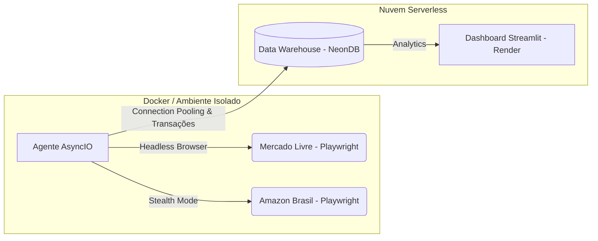

# 🦇 Vigilante de Preços: Pipeline ETL Híbrido (SaaS)

[](https://github.com/KelvinSousaDev/vigilante-de-precos/actions)
[](https://vigilante-api.onrender.com)
[](https://www.python.org/)
[](https://neon.tech/)
[](https://www.docker.com/)

> **Resumo:** Sistema autônomo de inteligência de preços e Engenharia de Dados. Opera em arquitetura híbrida para superar bloqueios de WAF, extraindo, transformando e carregando (ETL) dados em tempo real para tomada de decisão.

---

## 🎯 O Problema & A Solução

Grandes E-commerces (Amazon, Mercado Livre) utilizam precificação dinâmica e bloqueios agressivos contra bots. Um monitoramento simples via _requests_ na nuvem é bloqueado em minutos.

**O Vigilante resolve isso com uma Arquitetura Híbrida e Distribuída:**

1.  **Extração Stealth (Edge):** Um agente Python/Playwright roda em ambiente conteinerizado isolado, simulando um navegador real (Bypass de WAF).
2.  **Transformação & Carga (Nuvem):** Os dados são limpos e enviados para um Data Warehouse (PostgreSQL) na nuvem utilizando pools de conexão de alta performance.
3.  **Visualização (SaaS):** Um Dashboard acessível via web consome os dados para análise de tendência.

---

## 🏗️ Arquitetura de Engenharia (ETL)


```mermaid
graph LR
    subgraph Extract & Transform [Docker / Ambiente Isolado]
    A[Agente AsyncIO] -->|Headless Browser| B(Mercado Livre - Playwright)
    A -->|Stealth Mode| C(Amazon Brasil - Playwright)
    end

    subgraph Load [Nuvem Serverless]
    A -->|Connection Pooling & Transações| D[(Data Warehouse - NeonDB)]
    D -->|Analytics| E[Dashboard Streamlit - Render]
    end
```

## 🛡️ Diferenciais Técnicos (Por que não é "só um script"?)

- Bypass de WAF Avançado: Substituição de requests estáticos pelo ecossistema Playwright operando de forma assíncrona com Semaphore para controle estrito de concorrência.

- Engenharia de Banco de Dados: Uso da biblioteca asyncpg para implementar Connection Pooling. Elimina o overhead de TCP Handshakes repetitivos e utiliza Transações Atômicas para garantir integridade referencial entre as Tabelas Fato e Dimensão.

- Infraestrutura Imutável: Empacotamento via Docker Multi-Stage Build, isolando as dependências pesadas no builder e entregando uma imagem final ultraleve e segura para execução.

- Pipeline CI/CD: GitHub Actions rodando testes unitários a cada commit (Quality Gate) antes do Deploy contínuo.

## 🧪 Stack Tecnológica

- Backend / ETL: Python 3.12, AsyncIO, Playwright.

- Banco de Dados: PostgreSQL (Neon Tech), asyncpg.

- Infraestrutura: Docker, Render, GitHub Actions (CI/CD).

- Frontend: Streamlit (Data App).

## 🚀 Como Executar Localmente

### Pré-requisitos

- Docker e Docker Compose instalados.

- Conta no Neon Tech (ou Postgres Local).

### Instalação via Docker (Recomendado)

```bash
# Clone o repositório
git clone [https://github.com/KelvinSousaDev/vigilante-de-precos](https://github.com/KelvinSousaDev/vigilante-de-precos)
cd vigilante-de-precos

# Configure o .env (use o .env.example como base)
# Construa a imagem blindada
docker build -t vigilante-etl .

# Execute injetando as variáveis em tempo de execução
docker run --rm --env-file .env vigilante-etl
```

## 👨‍💻 Autor

**Kelvin Sousa** - Engenharia de Dados & Backend [LinkedIn](https://www.linkedin.com/in/okelvinsousa) | [Portfólio](https://github.com/KelvinSousaDev)
