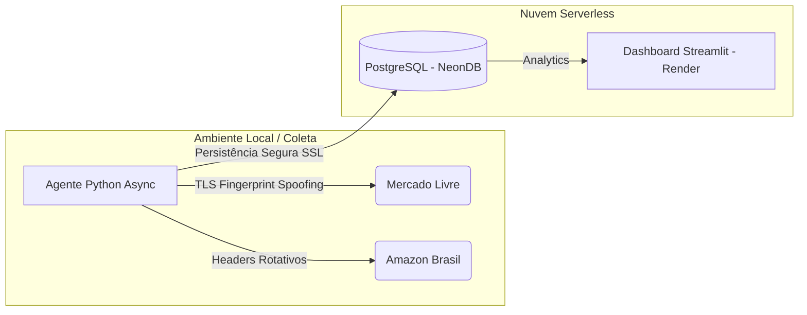

# 🦇 Vigilante de Preços: Engine de Monitoramento Híbrido (SaaS)

[](https://github.com/KelvinSousaDev/vigilante-de-precos/actions)
[](https://vigilante-dashboard.onrender.com)
[](https://www.python.org/)
[](https://neon.tech/)

> **Resumo:** Sistema autônomo de inteligência de preços que opera em arquitetura híbrida (Local + Nuvem) para superar bloqueios de WAF e garantir monitoramento 24/7.

---

## 🎯 O Problema & A Solução

Grandes E-commerces (Amazon, Mercado Livre) utilizam precificação dinâmica e bloqueios agressivos contra bots. Um monitoramento simples na nuvem é bloqueado em minutos; um monitoramento local não tem persistência.

**O Vigilante resolve isso com uma Arquitetura Híbrida:**

1.  **Coleta Tática (Local):** Um agente Python roda em ambiente residencial para garantir IP limpo e simular um navegador real (Bypass de WAF).
2.  **Inteligência (Nuvem):** Os dados são normalizados e enviados para um Data Warehouse (PostgreSQL) na nuvem.
3.  **Visualização (SaaS):** Um Dashboard acessível via web consome os dados para análise de tendência e tomada de decisão.

---

## 🏗️ Arquitetura de Engenharia

O projeto utiliza **Strategy Pattern** para lidar com diferentes estruturas HTML e **AsyncIO** para alta performance de coleta.


```mermaid
graph LR
    subgraph Edge [Ambiente Local / Coleta]
    A[Agente Python Async] -->|TLS Fingerprint Spoofing| B(Mercado Livre)
    A -->|Headers Rotativos| C(Amazon Brasil)
    end

    subgraph Cloud [Nuvem Serverless]
    A -->|Persistência Segura SSL| D[(PostgreSQL - NeonDB)]
    D -->|Analytics| E[Dashboard Streamlit - Render]
    end
```

## 🛡️ Diferenciais Técnicos (Por que não é "só um script"?)

- **Bypass de WAF Avançado:** Utilização de curl_cffi para falsificar a assinatura JA3 (TLS Fingerprint), simulando um Chrome 120 legítimo. O Requests comum seria bloqueado instantaneamente.

- **Tratamento de Dados Robusto:** Pipeline ETL que normaliza moedas, remove sujeiras de formatação (ex: \n, \t) e trata erros de conexão com Exponential Backoff.

- **Pipeline CI/CD:** Implementação de GitHub Actions rodando testes unitários (pytest) a cada commit. O Deploy no Render só ocorre se a bateria de testes passar (Quality Gate).

- **Alta Disponibilidade:** O sistema roda de forma autônoma via agendamento, com tratamento de exceções e logs de execução em banco.

## 🧪 Stack Tecnológica

- **Backend:** Python 3.12, AsyncIO, BeautifulSoup4.

- **Infraestrutura:** Docker (Dev), Render (Prod), Neon Tech (Serverless Postgres).

- **Qualidade:** Pytest (Testes Unitários), GitHub Actions (CI).

- **Frontend:** Streamlit (Data App).

## 🚀 Como Executar Localmente

### Pré-requisitos

- Python 3.12+

- Conta no Neon Tech (ou Postgres Local)

### Instalação

```bash
# Clone o repositório
git clone [https://github.com/KelvinSousaDev/vigilante-de-precos](https://github.com/KelvinSousaDev/vigilante-de-precos)
cd vigilante-de-precos

# Instale as dependências
pip install -r requirements.txt

# Configure o .env (use o .env.example como base)
# Execute as migrações do banco
python ExeDoBanco/setup_banco.py
```

## Rodando os Testes

Garanta que a lógica de limpeza de preços está íntegra:

```Bash
python -m pytest
```

## 👨‍💻 Autor

**Kelvin Sousa** - Engenharia de Dados & Backend [LinkedIn](www.linkedin.com/in/okelvinsousa) | [Portfólio](https://github.com/KelvinSousaDev)
